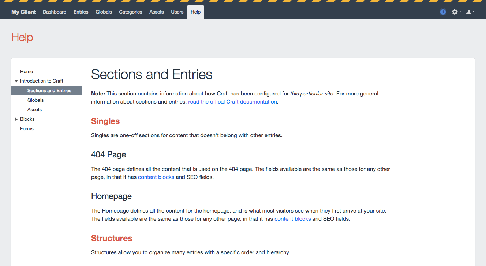

# Craft Help

Craft Help allows developers to provide CMS documentation to their clients directly inside the control panel.



## Installation

1. Copy the included `help` folder into `craft/plugins`.
2. Navigate to **Plugins** in the Craft CP.
3. Click the **Install** button in the row for the Help plugin.
4. Click **Help** to change where Help looks for your help templates. The default location is `craft/templates/_help`.

## Usage

Adding your help documentation is as easy as creating Twig or HTML files in `craft/templates/_help` with a structure somewhat like this (the details are really up to you, though):

```
|-- index.twig
|-- 01-sections
|   |-- 01-news.twig
|   |-- 02-events.twig
|   |-- index.twig
|-- 02-assets
|   |-- index.twig
```

`index.twig` will be shown when a user clicks **Help** in the top nav. Folders will show the user a tree menu with a listing of its Twig files (except index.twig). Every folder should have an `index.twig` file. The numbered prefixes to each folder and file name are completely optional, but they're a handy way to force the items in the navigation menu to appear in the order you want.

To have the navigation menu display nice-looking titles and not the file name, just include this Twig comment at the top of your help files:

```
{# Title: Entry Types #}
```

Before you add your own help templates, click **Help** in the top nav of the CP. There is a Getting Started document with helpful information about writing your own help documentation. This document will only be shown until you add your own file at `craft/templates/_help/index.twig`, and then it's gone forever!